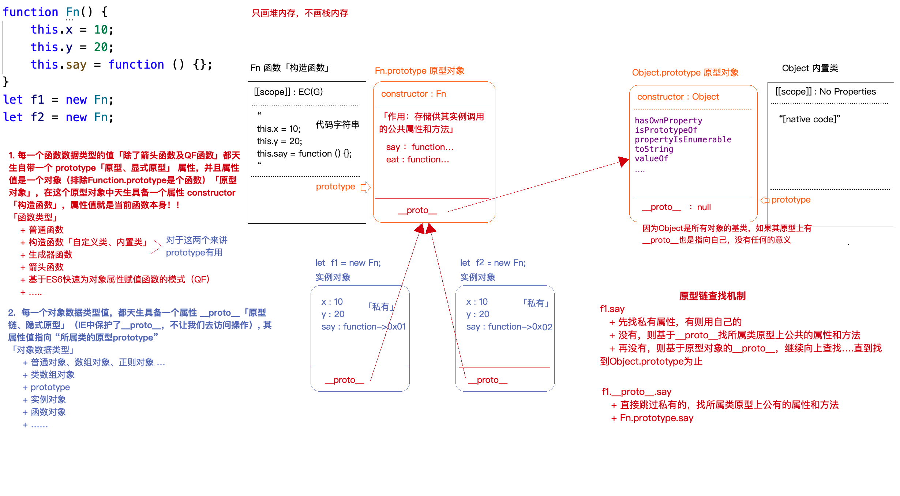

# new函数的处理过程

## JS内置类 
    + Number  String  Boolean  Symbol  BigInt
    + Object
       + Object
       + Array
       + NodeList、HTMLCollection...
       + RegExp
       + Date
       + Set
       + Map
       + ...
    + Function 
  
[20201216/inde.html]  

`dir(box)`每一个HTML元素对象都有一个自己所属的类：
divDOM对象（实例） ->  HTMLDivElement  ->  HTMLElement  ->  Element -> Node -> EventTarget -> Object

* 操作一个DOM对象，就是操作某一个内置类的实例。

## 自定义类

* 自己搞点类，和创建他的实例

```javascript
function Fn(x, y) {
    let total = x + y;
    this.x = x;
    this.y = y;
    return total;
}

let total = Fn(10, 20);
let f = new Fn(10, 20);
```
[20201216/1.png]  

* Fn：类「构造函数」 -> **所有的类**都是 _函数数据类型_ 的（包含内置类）
 + 内置类：Number/String/Boolean/Symbol/BigInt/Object/Array/RegExp/Function
 ```javascript
 console.log(typeof Object); //=>"function"
 console.log(typeof Array); //=>"function"
 ```

* f:实例对象 -> **所有的实例**都是 _对象类型_ 的
  + 但是JS中有特殊性」
    ```javascript
    function sum(){}  -> Function实例  ->  typeof sum==="function"
    let arr=[]  -> Array实例  -> 首先是一个数组，其次才是对象
    ```

* JS中创建值(实例)有两种方案：
  + 字面量方案  
    `let n = 1`
  + 构造函数方案  
    `let n = new Number(10)`
* 对于对象和函数类型来讲，两种方案除了语法上的区别，没有啥特别的不同
* 但是对于原始值类型，区别还是很大的。
  + 字面量方式，返回的是原始值类型
  + 构造函数方式，返回的都是对象类型，但，**都是所属类的实例**

 ```javascript
 let n = 10; //原始值
let m = new Number(10); //对象
console.log(m.toFixed(2)); //->'10.00'
// 默认隐式转换
console.log(n.toFixed(2)); //->'10.00'  浏览器默认会把“n”转换为“new Number(n)”对象类型的实例
// 所以也能调用方法
console.log(n - 10); //->0
console.log(m - 10); //->0  浏览器会默认把对象转换为数字「Symbol.toPrimitive -> valueOf -> toString -> Number」 
// m[Symbol.toPrimitive] undefined
// m['valueOf'] f
// m['valueOf']() 10
// toString
 ```
## 特殊：Symbol / BigInt 是不允许被new

`let sy1 = Symbol(AA)`  

* Uncaught TypeError: Symbol/BigInt is not a constructor 不是构造函数不允许被new
* 想获取Symbol对应的对象类型值  (靠的是)=> Object([value])获取当前[value]对应的对象类型值

`Object(sy1)`里面放任何值，都能变成对应的对象类型。


# 面向对象 细节知识点补充

```javascript
function Fn(x, y) {
    let total = x + y;
    this.x = x;
    this.y = y;
    this.say = function () {};
    return total;
}
let f = new Fn(10, 20);
let f2 = new Fn; //这样也会把Fn执行，也会创建其实例对象
```

## new Fn  VS  new Fn()

 * 第二个可以传递实参，第一个不能
 * [运算符优先级的区别](https://developer.mozilla.org/zh-cn/docs/web/javascript/reference/operators/operator_precedence)
   + new Fn()  20
   + new Fn  19
   + 成员访问  obj.xx  20

优先级造成的影响：

```javascript
new Fn().say()
// + new Fn()
// + 实例.say()

new Fn.say();
//  + Fn.say 值V
//  + new V() 
```

### instanceof

```javascript
console.log(f instanceof Fn); //->true
console.log(f instanceof Array); //->false
console.log(f instanceof Object); //->true 
// 缺点
console.log(1 instanceof Number); //->false
console.log(new Number(1) instanceof Number); 
```

### in / hasOwnProperty

* 验证一个属性是否属于这个对象：attr in object
* 验证一个属性是否属于这个对象的**私有属性**：[object].hasOwnProperty([attr])

```javascript
console.log('say' in f); //->true
console.log(f.hasOwnProperty('say')); //->true
console.log('toString' in f); //->true
console.log(f.hasOwnProperty('toString')); //->false
console.log(f.hasOwnProperty('hasOwnProperty')); //->false
 ```

### 验证某个属性是否属于对象的公有属性(是它的属性，还不是私有的属性)

 ```javascript
 function hasPubProperty(obj, attr) {
    return (attr in obj) && !obj.hasOwnProperty(attr);
}
// console.log(hasPubProperty(f, 'hasOwnProperty')); //->true
 ```
* 缺点：无法检测某个属性既是私有的，也是公有的

# 原型和原型链处理机制

   

 ```javascript
function Fn() {
    this.x = 10;
    this.y = 20;
    this.say = function () {};
}
Fn.prototype.say = function () {};
Fn.prototype.eat = function () {};

let f1 = new Fn;
let f2 = new Fn;

console.log(f1 === f2); //->false
console.log(f1.x === f2.x); //->true  比较属性值「原始值」
console.log(f1.say === f2.say); //->false  比较属性值「对象」(地址)
```

# 练习题

[20201218/1.png](27原型重构的一些知识)  

```javascript
function Fn() {
    this.x = 100;
    this.y = 200;
    this.getX = function () {
        console.log(this.x);
    }
}
Fn.prototype.getX = function () {
    console.log(this.x);
};
Fn.prototype.getY = function () {
    console.log(this.y);
};
let f1 = new Fn;
let f2 = new Fn;
console.log(f1.getX === f2.getX);
console.log(f1.getY === f2.getY);
console.log(f1.__proto__.getY === Fn.prototype.getY);
console.log(f1.__proto__.getX === f2.getX);
console.log(f1.getX === Fn.prototype.getX);
console.log(f1.constructor);
console.log(Fn.prototype.__proto__.constructor);
f1.getX();
f1.__proto__.getX();
f2.getY();
Fn.prototype.getY();
```

* 箭头函数、QF函数、大部分内置的方法函数(写在类原型.上的)没有prototype，这样就不存在new执行。

* `f1.hasOwnProper(...)`基于原型链查找机制，找到`Object.prototype.hasOwnProperty`，并且把找到的这个方法hasOwnProperty执行，方法中的this是f1，所以检测某个属性「第一个参数」是否为f1对象「this」的私有属性 => `Object.prototype.hasOwnProperty.call(f1,'xx')`

```javascript
let n = 10;
new n.constructor(10) // 找所属类
// => Number{10}
```

* this在原型链查找中的应用，`f1.hasOwnProperty()`this为f1，以前面的「.」为准。`Object。prototype.hasOwnProperty.call(f1)`则是直接查找到方法，然后用call改this。
  + 所以，比如`[].push(10)`，只是在描述作用，而不是在描述操作过程，也可以写作：`Array.prototype.push.call([],10)`


[20201218/1.js/2.png](46:05)  

```javascript
function fun() {
    this.a = 0;
    this.b = function () {
        alert(this.a);
    }
}
// 重构原型对象
fun.prototype = {
    b: function () {
        this.a = 20;
        alert(this.a);
    },
    c: function () {
        this.a = 30;
        alert(this.a)
    }
}
var my_fun = new fun();
my_fun.b();
my_fun.c(); 
```

* 重构原型对象问题(重构之后，旧的heap被释放)
  + 丢失了constructor
  + 原始内置原型对象上的属性和方法也会丢失
* 引申
  + 所以内置类的原型是不允许被直接这样重构的，但是可以单独的给原型上的某一个方法重新赋值
    + `Array.prototype={}`没用的
    + `Array.prototype.push = function(){}`可以的
    + `Array.prototype.myUnique = function(){}`可以的: 基于内置类原型扩展方法
* 解决方式
  + 方案一[20201218/2.png]
    + func.prototype = Object.assign(func.prototype,{
        xxx: xxx,
        ...
      })
  + 方案二[20201218/2-2.png]
    + `fun.prototype = new fun()`

### Object.assign

```javascript
let obj1 = {
    n: 10,
    m: 20,
    header: {
        a: 100
    }
};
let obj2 = {
    x: 10,
    m: 30,
    header: {
        b: 200
    }
}; 
```
* obj2覆盖obj1：只实现浅比较（浅合并）：只对第一级合并
  + `let obj = Object.assign(obj1, obj2)`

```javascript
console.log(obj);
console.log(obj === obj1); //true 返回的不是新对象，而是原始的obj1对象
console.log(obj === obj2); //false
```

* 返回的是obj1，obj1被改了。(返回全新object方式如下)

```javascript
let obj = Object.assign({}, obj1, obj2);
console.log(obj); //->返回的是第一个参数「也就是全新的一个对象」
```


# NOTE

* __proto__被IE保护，不可使用。

* 没有的，顺着__proto__找。