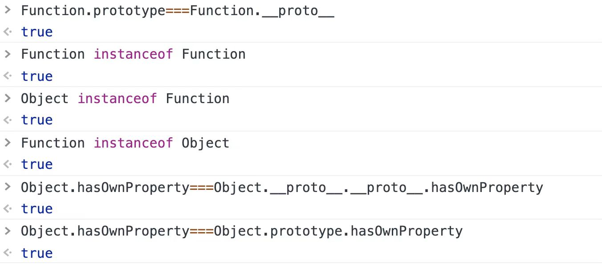

# 在内置类的原原型上扩展方法

```javascript
let arr = [10, 20];
console.log(arr.slice(1).map(item => item * 10).push('X').toFixed(2).split('.'));

  + 调用起来方便，可以直接基于实例去调用方法，方法中的this就是实例「也就是我们要操作的值」
  + 可以实现链式调用
  + 自己扩展的方法最好设置前缀“myXxx”，防止自己扩展的方法覆盖原始内置的方法
```

```javascript
const checkVal = val => {
    val = +val;
    return isNaN(val) ? 0 : val;
};
Number.prototype.plus = function plus(val) {
    // this -> n 「对象，严格模式下可以是原始值」
    val = checkVal(val);
    return this + val;
};
Number.prototype.minus = function minus(val) {
    val = checkVal(val);
    return this - val;
};

let n = 10;
let m = n.plus(10).minus(5);
console.log(m); //=>15（10+10-5） 
```

# 函数的三种角色

+ 函数
    + 普通函数「闭包作用域」
    + 构造函数「类、实例」
    + 生成器函数
+ 对象

[20201220/1.png/2.js](原型链上方法的查找方式)  

* Array.prototype是Array对象，`Array.isArray(Array.prototype)`为true
* 写在原型上:供实例调用的「偏业务」
* 当做对象，设置的静态私有属性:工具类方法一般都写在这「偏功能」

* Function.prototype是函数，但是没有返回值

* 没有prototype（不能被new）：
  + 尖头函数
  + ES6快速赋值的函数QS？函数
  +  
  + Function.prototype「匿名空函数」

* Function自己是自己的实例，`Function.prototype === Function.__proto__`，`Function instanceof Function`都是 true

* 原型链上的去查找一个方法的时候，是顺着`__proto__`查找的。
  

[20201220/2.png/2.js](原型链上方法的查找方式)   

```javascript
function Foo() {
    getName = function () {
        console.log(1);
    };
    return this;
}
Foo.getName = function () {
    console.log(2);
};
Foo.prototype.getName = function () {
    console.log(3);
};
var getName = function () {
    console.log(4);
};
function getName() {
    console.log(5);
}
Foo.getName();
getName();
Foo().getName();
getName();
new Foo.getName();
new Foo().getName();
new new Foo().getName();
```

* 创建函数的实例，没用到也会把函数执行。
* 构造函数中，只有this.xxx = xxx才会和实例有关系。
* `new Foo`没有()，优先级19；`new Foo()`优先级20。

# 基于ES6创造类的语法

## ES5写法

```javascript
function Fn(x) {
    // 实例的私有属性和方法
    this.x = x;
    this.y = 200;
}
// 原型链上共调用的属性方法
Fn.prototype.z = 300;
Fn.prototype.getX = function () {};
// 静态私有属性
Fn.m = 400;
Fn.getM = function () {};
// 执行方式
Fn.getM();
Fn(100);
new Fn(100);
```

## ES6新写法

```javascript
class Fn {
    constructor(x) {
        this.x = x;
        // this.y = 200;
    }
    y = 200; //ES7的写法：设置的是私有的属性，相当于`this.y = 200`

    //设置公有方法，Fn.prototype
    getX() {} // 只能这么写，没有prototype
    // getX = function(){}// 不能这么写 变成私有的了
    // getX = () => {} // react可以这么写，但是原声不支持

    //---- 设置静态私有属性方法
    static m = 400;
    // static getM = function () {} //有prototype
    static getM() {} //没有prototype
}

// 公有的属性，只能外面单独加
Fn.prototype.z = 300; 

Fn(); //=>Uncaught TypeError: Class constructor Fn cannot be invoked without 'new' 基于class创建的类只能被new执行

console.dir(Fn.getM);// 能输出，这种写法没有prototype，所以此静态私有的方法不能被new
console.log(Fn.getM);// 能输出，这种写法没有prototype

let f = new Fn(100);
console.log(f);
```

### 类似延伸：
```javascript
let obj = {
    fn: function () {}, // 有prototype
    fn() {} // 没有prototype
};
```


```javascript
function Modal(x,y){
    this.x=x;
    this.y=y;
}
Modal.prototype.z=10;
Modal.prototype.getX=function(){
    console.log(this.x);
}
Modal.prototype.getY=function(){
    console.log(this.y);
}
Modal.n=200;
Modal.setNumber=function(n){
    this.n=n;
};
let m = new Model(10,20);
```

# 重写内置new

```javascript
function Dog(name) {
    this.name = name;
}
Dog.prototype.bark = function () {
    console.log('wangwang');
};
Dog.prototype.sayName = function () {
    console.log('my name is ' + this.name);
};
/* let sanmao = new Dog('三毛');
sanmao.sayName();
sanmao.bark(); */
```

### 实现：

```javascript
/*
 * Ctor(构造函数的缩写):要操作的构造函数「创建它的实例」 
 * params:数组,存储给Ctor传递的实参集合
 */
function _new(Ctor, ...params) {
    // 1、创建一个实例对象：创建一个对象，让其__proto__指向Ctor.prototype
    let obj = {};
    obj.__proto__ = Ctor.prototype;// 不兼容IE

    // 2、把构造函数当做普通函数执行，并且让函数中的THIS指向创建的实例对象
    let result = Ctor.call(obj, ...params);

    // 3、根据构造函数返回的结果，判断我们最后返回的是实例对象还是自己返回的值
    if (/^(object|function)$/.test(typeof result)) return result;
    return obj;
}
```

### 优化：兼容IE

* 不用__proto__的写法：

```javascript
function _new(Ctor, ...params) {
    let obj = Object.create(Ctor.prototype);// IE678不兼容
    let result = Ctor.call(obj, ...params);
    if (/^(object|function)$/.test(typeof result)) return result;
    return obj;
}
```

* 不用扩展符的写法：

```javascript
function _new(Ctor) {
    // arguments 存储所有传递的实参信息，包含Ctor
    // 后期讲的：[].slice.call(arguments, 1)  把类数组转化为数组，并进行截取 「鸭子类型」
    var params = [].slice.call(arguments, 1),
        obj = Object.create(Ctor.prototype),
        result;
    result = Ctor.apply(obj, params);
    if (/^(object|function)$/.test(typeof result)) return result;
    return obj;
} 
```

* 加容错判断

```javascript
function _new(Ctor) {
    var reg = /^(object|function)$/i,
        params,
        obj,
        result;
    if (typeof Ctor !== "function" || !reg.test(typeof Ctor.prototype)) throw new TypeError('Ctor is not a constructor');
    params = [].slice.call(arguments, 1);
    obj = Object.create(Ctor.prototype);
    result = Ctor.apply(obj, params);
    if (reg.test(typeof result)) return result;
    return obj;
}
let sanmao = _new(Dog, '三毛');
sanmao.bark(); //=>"wangwang"
sanmao.sayName(); //=>"my name is 三毛"
console.log(sanmao instanceof Dog); //=>true
```

* 兼容IE678

```javascript
if (!Object.create) {
    // IE 6~8
    Object.create = function create(prototype) {
        if (!/^(object|function)$/i.test(typeof prototype)) throw new TypeError('Object prototype may only be an Object or null');

        function proxy() {}
        proxy.prototype = prototype;
        return new proxy;
    };
}
```

```javascript
/*
 * Object.create([prototype]):创建一个空对象，并且让对象的__proto__指向[prototype]（把[prototype]作为创建空对象的原型）
 */
let obj = Object.create(10); //=>Uncaught TypeError: Object prototype may only be an Object or null 只能传递对象或者null才可以
let obj = Object.create(null); //=>创建了一个非任何类实例的空对象（它没有__proto__）「可以被理解为纯粹的对象」

let prototype = Array.prototype;
let obj = Object.create(prototype);
console.log(obj);
```

# NOTE:

* this所代表的值一定是对象  

