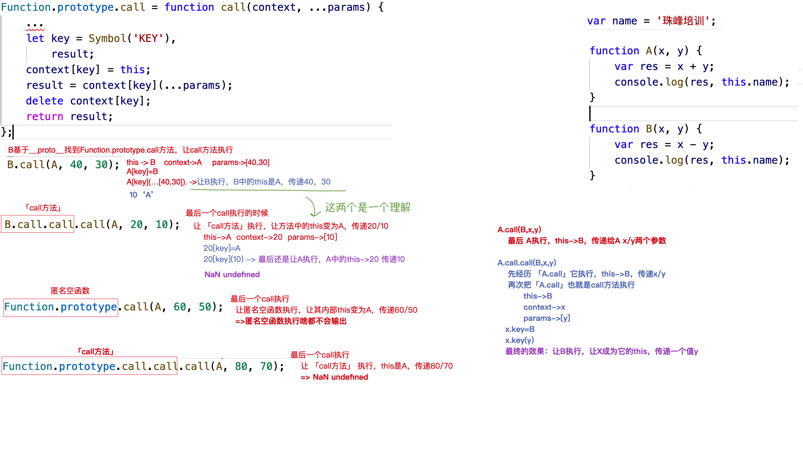

# JS中THIS的五种情况梳理

事件绑定
函数执行（包括自执行函数）
new构造函数
箭头函数
call/apply/bind

# 引子

```javascript
let obj = {
    x: 0,
    fn() {
        // this -> obj
        let self = this;
        // 定时器里面的this是window，这就是self存在的意义
        // 当内部需要this的时候，self取而代之
        setTimeout(function () {
            // this -> window
            self.x++;
            console.log(obj.x);
        }, 1000);
    }
};
obj.fn();
```

```javascript
let obj = {
    x: 0,
    fn() {
        setTimeout(() => {
            this.x++;
            console.log(obj.x);
        }, 1000);
    }
};
obj.fn();
```

* 尖头函数能达到一样的效果，自己没有this。所以，里面使用尖头函数

```javascript
let obj = {
    x: 0,
    fn: () => {
        // this->window
        console.log(this);
    }
};
obj.fn();
```

* 尖头函数没有自己的this，在最外面用就睡是window，所以外面一般是function函数

# call、apply、bind的应用和区别


 * Function.prototype
    + call
    + apply
    + bind

每一个函数都是Function的实例，都可以调用其原型上的三个方法，用来实现函数内部THIS的改变

```javascript
function fn(x, y) {
    console.log(this, x, y);
    return x + y;
}
let obj = {
    name: 'obj'
};
fn(); //->this:window
obj.fn(); //->Uncaught TypeError: obj.fn is not a function
```
* fn首先基于`__proto__`找到`Function.prototype`上的`call`方法，把call方法执行
   + 传递的实参 obj
   + call方法中的this -> fn

* call方法执行的作用是：把fn「this」执行;并且让方法fn「this」中的this指向变为第一个传递的实参「obj」

```javascript
fn.call(obj);
fn.call(obj, 10, 20); //this->obj x->10 y->20
fn.call(10, 20); //this->10 x->20 y->undefined
fn.call(); //->非严格模式下：this->window「传递第一个参数是null/undefined也是window」 
// 严格模式下：this->undefined「传递的第一个参数是谁，this就是谁」
let result = fn.call(obj, 10, 20);
console.log(result);
```

### apply和call只有一个区别：传递给执行函数的实参方式不一样
       
* fn.call([context],params1,params2,...)
* fn.apply([context],[params1,params2,...])

最后结果都是把params一项项的传递给fn的

```javascript
let arr = [10, 20];
fn.call(obj, arr); //->this:obj x:arr y:undefined
fn.apply(obj, arr); //->this:obj x:10 y:20
fn.call(obj, ...arr); //->fn.call(obj, 10, 20)  //->this:obj x:10 y:20
// ===>call的性能要比apply好一丢丢「尤其是传递的实参在三个以上」
```

## 应用一：实现数组求最大值/最小值

```javascript
let arr = [1, 5, 6, 23, 14, 15];

// 排序法
arr.sort((a, b) => b - a);
console.log(arr[0]);

Math.max/min
console.log(Math.max(arr)); //->NaN
console.log(Math.max(...arr)); //->23
console.log(Math.max.apply(Math, arr)); //->23

// 假设法
let max = arr[0];
arr.slice(1).forEach(item => {
    if (item > max) {
        max = item;
    }
});
console.log(max);

// 自己拼字符串
let str = 'Math.max(' + arr + ')'; //->'Math.max(1,5,6,23,14,15)'
console.log(eval(str)); //->23
```

## 应用二：鸭子类型（长的像鸭子，我们就称它为鸭子，最主要的是想让其具备鸭子的特点）

### arr.slice() 数组浅克隆

```javascript
Array.prototype.slice = function slice() {
    // this->ary
    let arr = [];
    for (let i = 0; i < this.length; i++) {
        arr.push(this[i]);
    }
    return arr;
};
// ary.slice() 数组浅克隆
```

* arguments的原型指向object，而不是array。所以它是「类数组」
* `console.log(arguments)`  `arguments.__proto__===Object.prototype`  类数组对象，不能直接使用数组的方法

#### 思考：想让类数组使用数组提供的方法(Array.prototype)

```javascript
function fn() {
 // 方案1:把类数组转换为数组
    // let arr = [...arguments];
    // let arr = Array.from(arguments); IE不兼容

    // 鸭子类型特点：让类数组借用数组原型上的方法，实现类数组转换为数组
    // let arr = Array.prototype.slice.call(arguments, 0);
    let arr = [].slice.call(arguments);// 简写
    return arr.reduce((total, item) => total + item);

 // 方案2：直接借用
    return [].reduce.call(arguments, (total, item) => total + item);

 // 方案3：改变原型指向「跟据「类数组」与「数组」的区别」
    arguments.__proto__ = Array.prototype;
    return arguments.reduce((total, item) => total + item);
}
console.log(fn(10, 20, 30, 40));
```

  

* 鸭子类型特点：让类数组借用数组原型上的方法，实现类数组转换为数组
* 「大部分数组的方法，都可以被类数组借用」 
  
比如：

```javascript
[].forEach.call(arguments, item => {
        console.log(item);
    });
```

### 更暴力的方法

* 不借用，更暴力的办法：直接把你的东西抢过来用

```javascript
let obj = {
    2: 3, //1
    3: 4, //2
    length: 2, //3 4
    push: Array.prototype.push
};
obj.push(1); //-> obj[2]=1  obj.length++
obj.push(2); //-> obj[3]=2  obj.length++
console.log(obj); //=>{2:1,3:2,length:4} 
```

* `Array.prototype.push`实现细节：

```javascript
Array.prototype.push = function (val) {
    // this -> 数组
    // 1.把val放置在数组的末尾
    // this[this.length]=val;

    // 2.数组长度累加
    // this.length++;
    // return this.length;
};
arr.push(10); 
```

* push根据length加上值，所以会替换掉

```javascript
let obj = {
    2: 3, //1
    3: 4, //2
    length: 2, //3 4
    push: Array.prototype.push
};
obj.push(1); //-> obj[2]=1  obj.length++
obj.push(2); //-> obj[3]=2  obj.length++
console.log(obj); //=>{2:1,3:2,length:4}
```

## bind没有把函数立即执行，只是把后期要改变的this及传递的参数预先存储起来「柯理化」

*  call/apply都是立即把函数执行「改变THIS和传递参数」 

```javascript
function fn(x, y, ev) {
    console.log(this, x, y, ev);
    return x + y;
}
let obj = {
    name: 'obj'
};

document.onclick = fn; //->点击文档才执行fn  this->document  x->MouseEvent事件对象  y->undefined
document.onclick = fn.call(obj, 10, 20); // 缺陷->立即执行了fn，我们需要点击的时候才执行
document.onclick = function (ev) {
    // this->document
    fn.call(obj, 10, 20, ev);
};
// 最终“进化出”的方法
// bind是干这个用的
document.onclick = fn.bind(obj, 10, 20);
```

```javascript
// 执行bind,fn没有立即执行「预先把fn/obj/10/20都存储起来了」,返回一个新函数
let proxy = fn.bind(obj, 10, 20);
// 执行返回的函数,proxy内部帮助我们把fn执行「this和参数该处理都处理了」
proxy(); 
```

# call bind 方法rewrite

## bind

```javascript
Function.prototype.bind = function bind(context, ...params) {
    // this(self)->fn  context->obj  params->[10,20]
    if (context == null) context = window;// == 可以等于undefined/null
    let self = this;// 注意this的保存

    return function proxy(...args) {// curry的应用
        // args->存储执行proxy传递的值，例如：ev事件对象
        params = params.concat(args);
        return self.call(context, ...params);
    };
};
```

* （bind不兼容IE678）兼容IE678写法：

```javascript
Function.prototype.bind = function bind(context) {
    if (context == null) context = window;
    var params = [].slice.call(arguments, 1),
        self = this;
    return function proxy() {
        var args = [].slice.call(arguments);
        params = params.concat(args);
        return self.apply(context, params);
    };
};

function fn(x, y, ev) {
    console.log(this, x, y, ev);
    return x + y;
}
let obj = {
    name: 'obj'
};
// document.onclick = function (ev) {
//     // this->document
//     fn.call(obj, 10, 20, ev);
// };
document.onclick = fn.bind(obj, 10, 20);
//   + document.onclick = proxy
```

## call rewrite

* call的原理: 就是把`context`「要改变的this对象obj」和`self`「要执行的函数fn」之间建立关系

```javascript
Function.prototype.call = function call(context, ...params) {
    // this(self)->fn  context->obj  params->[10,20]
    context == null ? context = window : null;
    // 原始值类型无法加属性，所以处理一下
    if (!/^(object|function)$/i.test(typeof context)) context = Object(context);

    let self = this,
        key = Symbol('KEY'),// 保证唯一，不与原始属性冲突
        result;
    context[key] = self;
    result = context[key](...params);
    delete context[key];// 用完了记得删除
    return result;
};

function fn(x, y) {
    console.log(this, x, y);
    return x + y;
}
let obj = {
    name: 'obj',
    // call的原理 就是把context「要改变的this对象obj」和self「要执行的函数fn」之间建立关系
    // context.xxx=self;
    // context.xxx(10,20);
    // 删除新增的这个属性 delete context.xxx
    // fn: fn   //->obj.fn(10,20)
};
console.log(fn.call(100, 10, 20));
```

# 作业题

```javascript
var name = '珠峰培训';

function A(x, y) {
    var res = x + y;
    console.log(res, this.name);
}

function B(x, y) {
    var res = x - y;
    console.log(res, this.name);
}
B.call(A, 40, 30);
B.call.call.call(A, 20, 10);
// 最后一个call执行
//   + this:B.call.call 「call方法」
Function.prototype.call(A, 60, 50);
Function.prototype.call.call.call(A, 80, 70);
// 最后一个call执行
//   + this:Function.prototype.call.call 「call方法」
```

  

* `10+undefined`为NaN
* this为10没有name，`this.name`为undefined


# 延伸：四种数据类型检测的核心原理

## 数据类型检测
  + typeof 
      + `typeof null` -> `object`(bug)
      + typeof 不能细分对象类型的值，返回结果都是 `object` 「检测函数返回”function“」
      + `typeof 10` -> `number`  
        `typeof new Number(10)` -> `object`
      + **底层原理**：typeof是按照“值”在计算机中存储的“二进制”值来检测的，凡是以000开始的都认为是对象，null->000000
      + **优势**：使用起来方便，而且检测「原始值类型」及「函数类型」还是很方便的
  
  + instanceof 
      + 检测某个实例是否率属于某个类「临时拉来做数据类型检测：**弥补**typeof的一些不足，可以细分部分对象」
        ```javascript
        let x = [];

        console.log(x instanceof Array); //->true
        console.log(x instanceof RegExp); //->false
        console.log(x instanceof Object); //->true 
        // 问题
        console.log(10 instanceof Number); //->false 无法识别原始值类型
        console.log(new Number(10) instanceof Number); //->true
        ```
      + 问题很多
        + 不能检测原始值类型
        + 原型链可以被肆意重构，导致结果不准确
      + 底层原理
        + `xxx instanceof Ctor`
        + 首先查找(位于Function.prototype上)`Symbol.hasInstance`，如果存在基于这个检测`Ctor[Symbol.hasInstance](xxx)`
        + 如果没有，则基于原型链`__proto__`查找：只要`Ctor.prototype`出现在xxx的原型链上，结果就是`true`
  
```javascript
  class Fn {
    // 基于ES6 Class方式构建Symbol.hasInstance才会生效
    static[Symbol.hasInstance](x) {
        // x -> 检测的实例f
        return true;
    }
}
let f = new Fn;
// console.log([] instanceof Fn); //->true
// console.log(instance_of([], Fn)); //->true
```

```javascript
function Fn() {}
Fn.prototype = Array.prototype;
let f = new Fn;
console.log(f instanceof Array); //->true  但是f打死也不是数组啊
```

### rewrite instanceof (instanceof底层机制)

```javascript
// 检测example是否为Ctor的实例「example是实例对象,Ctor是一个构造函数」
function instance_of(example, Ctor) {
    let exmType = typeof example,
        ctorType = typeof Ctor;
    // 保证Ctor是一个构造函数
    if (ctorType !== "function" || !Ctor.prototype) throw new TypeError('Ctor is not a constructor!');
    // 不处理原始值
    if (example == null) return false;
    if (!/^(object|function)$/i.test(exmType)) return false;

    // 优先检测 Symbol.hasInstance
    if (typeof Ctor[Symbol.hasInstance] === "function") {
        return Ctor[Symbol.hasInstance](example);
    }

    // 没有这个属性，再按照 Ctor.prototype 是否出现在 example 的原型链上检测
    let prototype = Object.getPrototypeOf(example);
    while (prototype) {
        if (prototype === Ctor.prototype) return true;
        prototype = Object.getPrototypeOf(prototype);
    }
    return false;
} 
console.log(instance_of([], Array)); //->true
console.log(instance_of([], RegExp)); //->false
console.log(instance_of([], Object)); //->true
```

+ constructor
    + 和`instanceof`类似，都是拉来充数的，检测结果不一定准「constructor可以被肆意的修改」
    + 相当于`instanceof`来讲，他是支持原始值类型处理的，而且只会基于“直属类”来进行判断
      
+ `Object.prototype.toString.call([val])` -> `({}).toString.call([val])`
    + 鸭子类型的应用
    + 除了`null/undefined`，大部分数据类型所属类的原型上，都有`toString`方法；但是除了`Object.prototype.toString`用来检测数据类型，其余的都是转换为字符串的
    + 很强大、很专业、很准确....除了写起来麻烦，没有其余毛病
  * 返回值："[object ？]"
    + 先查找[val]的 `Symbol.toStringTag`「先找私有的，私有没有则向所属类原型上找」 ,属性值就是“？”的值
      比如：
      ```javascript
      dir( function*(){} ) // Symbol(Symbol.toStringTag): "Generator"
      ```
    + 没有，则内部是返回当前实例所属构造函数的名字 `[object Number/String/Null/Undefined/Object/Array/Function/GeneratorFunction...]`

 * `Array.isArray([val])`: 检测是否为数组
 * `Object.is(NaN,NaN)===true`: 检测是否为`NaN`  => `isNaN([val])`

 
 ```javascript
 let class2type = {},
    toString = class2type.toString; //->Object.prototype.toString

// 自己扩展（自定义classtype的名字）
class Fn {    
    // [Symbol.toStringTag]='Fn';
}
Fn.prototype[Symbol.toStringTag] = 'Fn';// 写在原型链上
let f = new Fn;
console.log(toString.call(f));
 ```